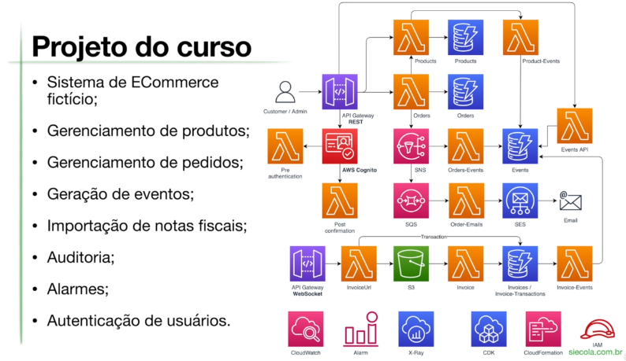

# AWS Serverless Ecommerce

This project was created following the course lessons [AWS Serverless with Typescript](https://siecola.com.br/courses/aws_lambda_serverless_nodejs_pt.html). In this course, a simple ecommerce system was developed with the functions of listing products, creating orders, sending emails, among others.

## Architecture

## Tech Stack

- AWS Lambda
- API Gateway REST
- API Gateway WebSocket
- DynamoDB
- DynamoDB Stream
- Simple Notification Service (SNS)
- Simple Queue Service (SQS)
- Simple Storage Service (S3)
- CloudWatch
- AWS Cognito
- Simple Email Service (SES)
- AWS EventBridge
- AWS CodePipeline
- AWS Identity and Access Management
- AWS CDK
- AWS X-Ray